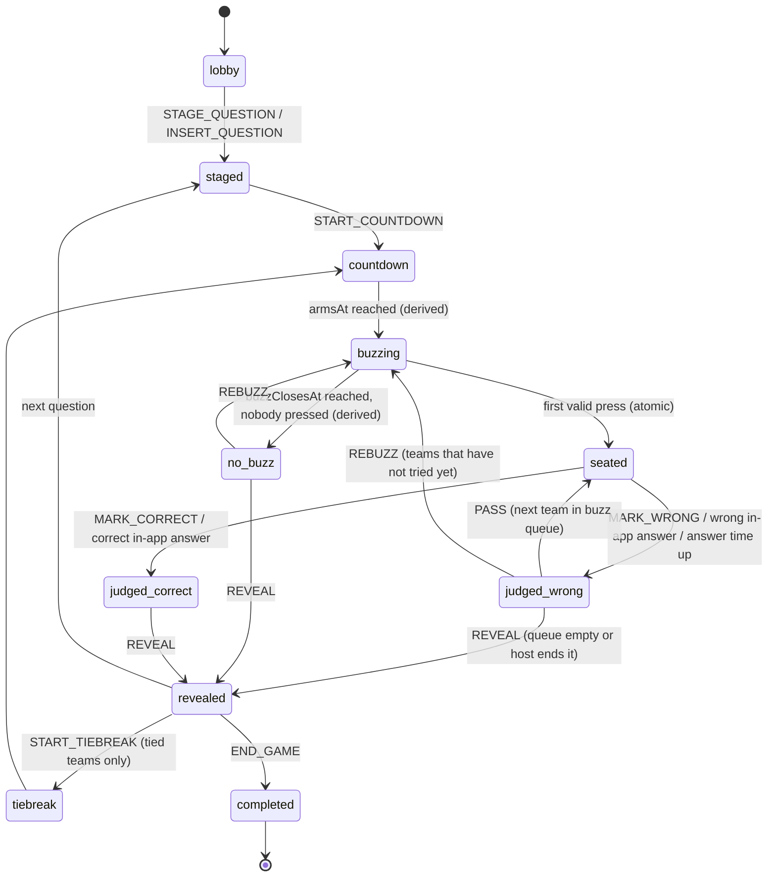

# Electric Answers: the buzzer round

> **Buzz first. Answer right.**
>
> In-app name: **Electric Answers**. Internal name: `buzzer` (quizType, routes, collections).

Status: **plan, nothing built yet.** Written 15 September 2026.

---

## 1. The round in one paragraph

The host puts a question up, either from the question pack or typed in on the spot. The lobby screen and every phone show it. The host starts a **3 · 2 · 1** countdown. When it hits zero, the **BUZZ** button goes live, but only on each **team leader's** phone. The first leader whose press reaches the server wins the seat and gets the answer window: A/B/C/D, True/False, or a fill-up box, depending on the question type. Or the leader speaks the answer out loud and the host judges it. The host sets which mode per question. Right answer scores. Wrong answer passes to the next-fastest team. If teams are level at the end, a sudden-death **tie-break** decides it.

---

## 2. Who sees what

| Surface | Who | What they do |
|---|---|---|
| **Host console** (std, `stud_admin/live`) | Admin | Picks or inserts the question, sets the answer mode, starts the countdown, judges spoken answers, passes, reveals, starts tie-breaks |
| **Arena display** (RAIDERX web, projector) | The room | All teams and scores, the question, the countdown, who buzzed first, the answer timer, the result |
| **App: team leader** | One per team | Sees the question, gets the **BUZZ** button, answers if their team wins the seat |
| **App: team member** | Everyone else on a team | Sees the same arena and knows who is on the buzzer and whether their team got the seat. No buttons |
| **App: solo entrant** | Not on a team | Spectates. Electric Answers is team-only in v1 |

Leader-only is enforced **on the server** from `leaderEmail`, the same resolution `resolveParticipantTeam()` already does. Hiding the button on a member's phone is cosmetic, not the guard.

---

## 3. The flow



### Step by step

1. **Lobby.** Arena and phones show every participating team with its score.
2. **Stage.** The host picks a question from the pack, or types one in and stages it. Arena and phones show the question text. MCQ options are shown too, unless the host hides them (see §9). Leaders see a dimmed buzzer: **GET READY**.
3. **Countdown.** The host presses **Start**. The server writes one instant, `armsAt = now + 3s`. Every screen counts 3 · 2 · 1 down to that instant, corrected for clock skew. The host does not press anything for 2 or 1.
4. **Buzzing.** At `armsAt` the BUZZ button goes live on every eligible leader's phone. The server accepts presses until `buzzClosesAt` (default 10s).
   - **False start:** a press before `armsAt` locks that team out for this question. Mashing the button early doesn't pay.
5. **Seated.** The first valid press wins the seat. Every later press is still recorded, in arrival order, as the **buzz queue** for passing. The arena flashes the winner: *KERNEL PANIC, Priya on the buzzer.* The winning team gets an answer window, `answerEndsAt` (default 15s).
6. **Answer**, depending on the answer mode the host set for this question:
   - **In app:** the leader's phone shows A/B/C/D, True/False, or a text box. The server grades it. The host can still override if a fill-up was right with a typo.
   - **Spoken:** the leader's phone shows **SPEAK NOW** and a timer. The host listens and presses **Correct** or **Wrong**.
7. **Judged.**
   - **Correct:** points to that team, then reveal.
   - **Wrong, or time up:** the wrong-answer penalty applies (default 0). The host presses **Pass**, and the next team in the buzz queue gets the seat with a fresh answer window. If nobody is left in the queue, the host can **Rebuzz** (reopen buzzing for teams that haven't tried yet) or **Reveal**.
8. **Reveal.** The correct answer shows on the arena and every phone. The scoreboard updates.
9. **Tie-break** (§7), then **End game.**

---

## 4. Why these design decisions

**One instant for the countdown, not three commands.** If the host sent "3", "2", "1", "GO" as separate updates, each phone would get them whenever its next poll landed, and phones would arm at different moments. Writing a single `armsAt` means every phone arms at the same real moment, provided it heard about `armsAt` before it arrives. The 3-second countdown is longer than the poll interval, which is what makes that true. The countdown is doing a fairness job, not just adding drama.

**The seat is won by an atomic conditional update.** Two leaders pressing within the same millisecond must not both win. The press endpoint claims the seat with one `findOneAndUpdate` that only matches while `phase === 'buzzing'`, the `instanceId` matches, and `seat.teamId` is null. The first write succeeds and every other one matches nothing. The database decides, not a read-then-write in JavaScript.

**One press per team per question**, enforced by a unique index `(instanceId, teamKey)`, the same pattern as `LiveAnswer` and `FastestFingerSubmission`.

**Passing is host-confirmed in v1.** A background job that auto-passes when the answer timer runs out would need a scheduler, and in spoken mode the host has to be the judge anyway. The console makes Pass one click. Auto-pass for in-app mode can come later.

**New questions are appended, never inserted in the middle.** Rounds reference `questionIndex`. Inserting mid-list would shift every later index under rounds that are already recorded.

**Electric Answers gets its own state machine** (`lib/buzzer/machine.js`), separate from KBC's and from `custom_live`'s. That's the same reason those two are separate: folding phases into a machine that doesn't use them is how unused fields end up on activities.

---

## 5. Fairness: what "first" means on phones

This needs to be said plainly before the event, not discovered during it.

**"First" means first to reach the server.** A leader on bad Wi-Fi is slower than one on good Wi-Fi by however many milliseconds their connection adds. Nothing on a phone can fully remove that.

What this plan does about it:

| Measure | Effect |
|---|---|
| `receivedAt` stamped before auth and before the database | Server-side slowness is never charged to a team |
| Poll every 500 ms during staged, countdown and buzzing | Every phone knows `armsAt` well before it arrives |
| False-start lockout | Removes the incentive to spam before zero |
| Press offsets shown in the host console (`+212 ms`, `+340 ms`) | The host can see when two presses were effectively a tie and call it |

**Optional latency compensation** (off by default, decide after rehearsal): the phone sends its skew-corrected press time. The server accepts it only inside `[receivedAt − cap, receivedAt]`, where `cap` is that phone's measured round-trip time, capped at 250 ms. A phone can never claim to be earlier than its own network allows. It is still partly trusting the client, which is why it's off until a rehearsal shows it's needed.

**Venue recommendation:** put all leader phones on the same venue Wi-Fi, not a mix of Wi-Fi and mobile data.

---

## 6. Scoring

| Setting | Default | Notes |
|---|---|---|
| Correct answer | `question.points` | Per question, as today |
| Wrong answer penalty | `0` | Set it negative to punish guessing |
| Points on a passed question | same as `question.points` | Set lower if a pass should be worth less |
| False start | locked out, no points lost | Optionally also a penalty |
| Time up in the seat | counts as wrong | Same penalty as a wrong answer |

Scores are written as **attempts** (§8), one row per team per seat. The leaderboard sums them, so negative penalties work without special cases.

---

## 7. Tie-break: sudden death

- The server computes the scoreboard on every read and returns `tiedTeams`: teams on equal points at a position that matters. Default is a tie for **1st**. It can be set to cover the podium.
- The console shows a **Start tie-break** button when that list isn't empty. It never starts automatically. The host decides when.
- A tie-break question can come from the pack or be typed in on the spot, like any other. Only the tied teams are eligible to buzz. Everyone else spectates, and the arena shows **SUDDEN DEATH**.
- The first correct answer wins. Wrong passes as normal. If nobody gets it, the host runs another tie-break question.
- A tie-break win is recorded as `tiebreakWins`, **separate from score**, so it breaks the tie without inflating the main total. Ranking is:
  **score ↓, then tiebreakWins ↓, then total seat time ↑**.

---

## 8. Data model (RAIDERX)

### `EventActivity.quiz`

```js
quizType: enum [..., 'buzzer'],

buzzer: {
  // Activity defaults. The host can override answerMode per question when staging.
  answerMode: 'in_app' | 'spoken',        // default 'in_app'
  countdownSeconds: 3,
  buzzWindowSeconds: 10,
  answerSeconds: 15,
  wrongPenalty: 0,
  passPoints: null,                       // null = question.points
  falseStartLockout: true,
  tieScope: 'first' | 'podium',           // default 'first'
  latencyCompensation: false,
  teamIds: [String],                      // empty = every team registered for the event

  round: {
    instanceId: ObjectId,                 // new on every stage, as with liveRound
    questionIndex: Number,
    phase: 'lobby'|'staged'|'countdown'|'buzzing'|'seated'|'judged_correct'
         |'judged_wrong'|'no_buzz'|'revealed'|'completed',
    answerMode: 'in_app' | 'spoken',      // this question's mode
    showOptionsBeforeBuzz: Boolean,
    stagedAt, armsAt, buzzClosesAt,
    eligibleTeamIds: [String],            // all teams, or the tied teams in a tie-break
    lockedOutTeamIds: [String],           // false starts
    attemptedTeamIds: [String],           // already had the seat for this question
    seat: { teamId, teamName, leaderEmail, leaderName, pressedAt, attempt, answerEndsAt },
    isTiebreak: Boolean,
  },

  // Per-event override when a leader has no phone: who answers for a team.
  answerers: [{ teamId: String, email: String }],
}
```

`countdown` → `buzzing` and `buzzing` → `no_buzz` are **derived from time**, like `effectiveRoundState()` does for `liveRound`. No scheduler.

### `QuestionSchema` changes

```js
type: 'mcq' | 'truefalse' | 'fillup',   // default 'mcq'. Existing questions stay mcq.
acceptedAnswers: [String],              // fill-up: every spelling the grader should accept
source: 'pack' | 'spot',                // spot = typed in by the host during the event
```

`correctAnswer` stays required for **in-app** questions. It becomes optional only for a **spoken** spot question, where the host is the judge. The console warns that there'll be nothing to show at reveal.

Fill-up grading normalises both sides: trim, lowercase, collapse whitespace. It matches against `correctAnswer` plus `acceptedAnswers`.

### New collections

**`buzz_presses`** is the buzz queue.

```js
{ activityId, eventId, instanceId, teamId, teamKey, participantId,
  receivedAt, offsetMs /* receivedAt − armsAt */, falseStart }
unique (instanceId, teamKey)
```

**`buzz_attempts`** is where scores come from, one row per seat.

```js
{ activityId, eventId, instanceId, questionIndex, teamId, teamName,
  attempt /* 1 = won the buzz, 2 = first pass, … */,
  answerMode, submittedAnswer, judgedBy /* 'auto' | host email */,
  outcome: 'correct' | 'wrong' | 'timeout', points, isTiebreak, decidedAt }
unique (instanceId, teamId)
```

---

## 9. API contract

### App → RAIDERX (`/api/flutter`, session-authenticated)

**`GET /events/status?v=2`** adds `quiz.buzzer`, shaped per viewer and **never containing the answer before reveal**:

```js
{ phase, instanceId, question: { text, type, options? },   // options omitted if hidden before buzz
  armsAt, buzzClosesAt, answerEndsAt, answerMode, isTiebreak,
  myTeam: { teamId, teamName, leaderName },
  amLeader, canBuzz, lockedOut, myQueuePosition,
  seat: { teamId, teamName, leaderName } | null,
  mySeat: Boolean,
  scoreboard: [{ teamId, teamName, score, tiebreakWins }],
  reveal: { correctAnswer, outcomeByTeam } | null }
```

`pollAfterMs` is 500 during `staged`, `countdown`, `buzzing` and `seated`.

**`POST /events/buzzer/press`** `{ activityId, instanceId }`
Refusals: `NOT_LEADER`, `NOT_ELIGIBLE`, `FALSE_START`, `LOCKED_OUT`, `BUZZ_CLOSED`, `ALREADY_PRESSED`, `STALE_QUESTION`.
Success: `{ seated: true }` or `{ seated: false, queuePosition }`.

**`POST /events/buzzer/answer`** `{ activityId, instanceId, answer }` (in-app mode, seated team's leader only)
Refusals: `NOT_YOUR_SEAT`, `SPOKEN_MODE`, `TOO_LATE`, `ALREADY_ANSWERED`.
Correctness is withheld until reveal, as with `quiz/answer`.

### Host console → RAIDERX (`/api/events/live/command` through std's `/api/host/live` proxy)

| Command | Payload | From phase |
|---|---|---|
| `STAGE_QUESTION` | `{ questionIndex, answerMode?, showOptionsBeforeBuzz? }` | lobby, revealed |
| `INSERT_QUESTION` | `{ question, stage?: true }` | any |
| `START_COUNTDOWN` | `{}` | staged |
| `MARK_CORRECT` / `MARK_WRONG` | `{}` (also overrides an in-app grade) | seated, judged_* |
| `PASS` | `{}` (next team in the buzz queue) | judged_wrong |
| `REBUZZ` | `{}` (teams that haven't tried yet) | judged_wrong, no_buzz |
| `REVEAL` | `{}` | judged_*, no_buzz |
| `START_TIEBREAK` | `{ teamIds, questionIndex? , question? }` | revealed |
| `SET_ANSWERER` | `{ teamId, email }` | any |
| `END_GAME` | `{}` | revealed |

**Console state GET** adds the correct answer, every press with `offsetMs`, the seat, the attempts so far, and `tiedTeams`.

### Arena display (RAIDERX web, public, no auth)

**`GET /api/events/[id]/arena`** returns the same shape as the app payload minus `my*`/`amLeader`. Never an answer before reveal, never an email.

---

## 10. Screens

### App: event lobby
A new card, **⚡ Electric Answers**, shown when the active activity is `quizType: 'buzzer'`. It opens the arena screen.

### App: arena screen, by phase

| Phase | Team leader | Team member |
|---|---|---|
| lobby | Team grid with scores | Same |
| staged | Question. Dimmed buzzer: **GET READY** | Question. "Priya is on the buzzer for you" |
| countdown | Big **3 · 2 · 1** | Same |
| buzzing | Full-width **BUZZ**, haptic on press | "Priya is on the buzzer" |
| seated, your team | In-app: A/B/C/D, True/False, or text box + timer. Spoken: **SPEAK NOW** + timer | "Your team has the answer" |
| seated, other team | "Kernel Panic got there first. You're #2 if they miss" | Same |
| judged | ✓ / ✗ flash, points, or **PASSED TO →** | Same |
| revealed | Correct answer, updated scores | Same |
| tie-break | **SUDDEN DEATH** banner, buzzer only if tied | Same |

If a leader is locked out after a false start, their phone says so: **FALSE START: sitting this one out**.

### Arena display (projector)
Team tiles with scores across the top, then the question in large type, then the countdown, then the winner flash with the leader's name, then the answer timer bar, then the result. Built for a room: big type, high contrast, nothing to read up close.

### Host console
The question pack list with a **Stage** button per question, plus an on-the-spot form (text, type, options or accepted answers, correct answer, points). An answer-mode toggle per question. **Start countdown**. A live press feed sorted by offset. A seat panel with **Correct / Wrong / Pass / Rebuzz / Reveal**. The scoreboard, and the tie-break panel when `tiedTeams` isn't empty.

---

## 11. Edge cases

| Situation | Handling |
|---|---|
| Leader has no phone or it died | Leader transfers leadership from the team screen (built, not yet shipped), or the host uses `SET_ANSWERER` |
| Nobody buzzes | Derived `no_buzz` → host Rebuzz or Reveal |
| Only one team buzzed and got it wrong | Queue empty → Rebuzz for the others, or Reveal |
| Two presses effectively simultaneous | Database picks one. Host sees both offsets and can override with Pass |
| Host inserts a question mid-game | Appended, so existing indexes don't move |
| Leader's session expires mid-round | Blocked on the 15-minute JWT fix (§12) |
| Phone polls late and misses the countdown | Arms off `armsAt` on its next poll, which is at most 500 ms late |
| Fill-up answer right but misspelt | Auto-graded wrong. Host overrides with Correct |
| Solo registrations | Spectate in v1 |

---

## 12. Before any of this: prerequisites

These block Electric Answers regardless of how well it's built:

1. **Fix the 15-minute event session.** Every press and answer is authenticated. As things stand, leaders start getting refused partway through the event.
2. **Ship the app build with live rounds and the team screen.** It's on `feat/live-rounds-client`, not pushed.
3. **Commit and deploy the std console** (`D:\PXEL\std`: uncommitted work, no git remote configured).
4. **Rotate the Atlas password** and remove the hardcoded admin password from the std scripts.

---

## 13. Build order and ownership

| # | Work | Where | Owner |
|---|---|---|---|
| 0 | Prerequisites (§12) | all | Claude / you |
| 1 | Schema: question `type`, `acceptedAnswers`, `source`, `quiz.buzzer`. Collections `buzz_presses`, `buzz_attempts` | RAIDERX | Claude |
| 2 | `lib/buzzer/machine.js`: phases, derived time transitions, legality table. Unit tests, including the atomic seat claim under concurrent presses | RAIDERX | Claude |
| 3 | Press and answer endpoints, host commands, console state, status `quiz.buzzer` payload, arena endpoint | RAIDERX | Claude |
| 4 | Scoring into `/quiz/leaderboard`: attempts sum, `tiebreakWins`, tie detection | RAIDERX | Claude |
| 5 | Electric Answers control room: question picker, spot insert, mode toggle, press feed, seat panel, tie-break | std | Codex |
| 6 | App: lobby card, arena screen, buzzer, answer inputs by type, haptics | app | Claude |
| 7 | Projector arena page | RAIDERX web | Claude |
| 8 | Leaderboard breakdown `buzzer` in std's event leaderboard | std | Codex |
| 9 | **Rehearsal:** 4+ phones on venue Wi-Fi, real questions. Measure press offsets and decide on latency compensation | venue | you + Claude |

Steps 1–4 are the contract. Codex (5, 8) and the app (6) can start from the contract in §9 as soon as step 3 is merged.

---

## 14. Decisions needed from you

Recommended defaults are in bold. None of these block step 1.

1. **Default answer mode:** **in app** · spoken
2. **Wrong answer penalty:** **0** · −half points · −full points
3. **Points on a passed question:** **full** · half
4. **After the queue runs out:** **host chooses Rebuzz or Reveal** · always Rebuzz · always Reveal
5. **Show MCQ options before the buzz:** **yes** (faster, more reading speed) · no (buzz on the question alone, options appear for the seated team)
6. **False start:** **lockout only** · lockout + penalty
7. **Tie-break scope:** **1st place only** · podium
8. **Timings:** **3s countdown · 10s buzz window · 15s answer**
9. **Solo entrants:** **spectate** · play as a team of one
10. **Latency compensation:** **off, decide after rehearsal** · on
