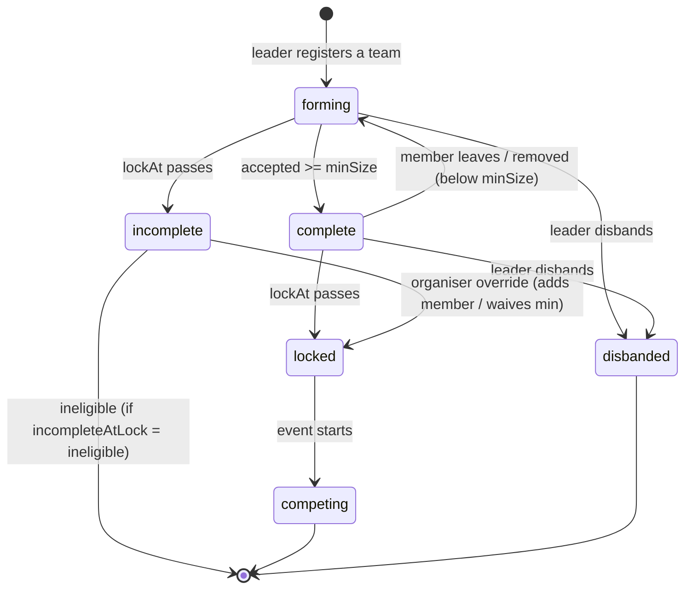

# Teams: rules and workflow

Status: **design, nothing built.** Written 15 September 2026.
Model: Unstop-style teams. **A team belongs to one event**, the organiser sets the rules per event, and the team locks at the registration deadline.

---

## 1. What exists today

### Answer to "is a team per event or general?"

**In the data, a team is already per event.** A team is an `EventRegistration` with `registrationType: 'team'`, and it carries an `eventId`. A unique index on `(eventId, participantEmails)` stops one person from holding seats in two teams at the same event. The **UI is the problem**: the Teams page presents them as general "Groups you lead or belong to", which makes a team look reusable across events. It isn't.

### What works

| Capability | Where |
|---|---|
| Create a team while registering (name + member emails) | `POST /api/events/register` |
| Accept or decline an invitation, with the seat claimed atomically | `POST /api/events/invitations` |
| Leader withdraws a **pending** invite (web) | `DELETE /api/events/invitations` |
| Leader revokes, resends, replaces, transfers leadership (**app only**) | `PATCH /api/flutter/teams` |
| Max 6 per team, one team per person per event | `src/config/constants.js`, seat index |

### What's missing or broken

| # | Gap | Evidence |
|---|---|---|
| G1 | **The Teams page is read-only.** No invite, remove, leave, rename, delete or transfer. | `teams/page.jsx` only has "Browse events" and "Open event" |
| G2 | **"+ Invite teammate" does nothing.** It links to the Teams page, where you already are. | `RightRail.jsx:67` |
| G3 | **Members can't be added after registration.** Teammates can only be named on the registration form. | no route adds to `members[]` |
| G4 | **A member can't leave a team.** | no route |
| G5 | **A leader can't remove someone who has accepted.** | invitations `DELETE` refuses accepted members ("a separate action", never built) |
| G6 | **The registration deadline is never enforced.** `Event.registrationClosesAt` exists and nothing reads it, so teams can be created and changed mid-event, after scores exist. | grep: no reader |
| G7 | **No minimum team size, and the maximum is global.** Every event gets max 6, min 1. The "loosers" team in the screenshot (1 in, 3 invited) counts as registered. | `TEAM.MAX_SIZE: 6` |
| G8 | **Web and app disagree on who the leader is.** Web's invite withdrawal checks `registration.email` (the registrant). The app's roster API checks `leaderEmail`. After a leadership transfer in the app, the new leader can't withdraw invites on web and the old leader still can. | `invitations/route.js` `DELETE` |
| G9 | **Accepting one invite leaves your other invites pending.** Accepting a second one then fails with a seat conflict instead of being tidied up. | `accept()` |
| G10 | **No team rename, no disband, no solo-to-team switch.** | no route |

---

## 2. The rules

### 2.1 Per-event team settings (organiser-controlled)

New `Event.teamRules`:

| Setting | Values | Default for existing events |
|---|---|---|
| `participation` | `solo` · `team` · `both` | `both` |
| `minSize` | 1–`maxSize` (counts the leader) | `1` |
| `maxSize` | 1–10 (counts the leader) | `6` |
| `lockAt` | when teams freeze | `registrationClosesAt`, else event start |
| `joinByCode` | leader can share a team code | `true` |
| `codeNeedsApproval` | a code join waits for the leader to approve | `false` |
| `incompleteAtLock` | `ineligible` · `allowed` | `ineligible` |

`registrationClosesAt` stays the deadline for **creating** a registration. `lockAt` is when **changing** a team stops. By default they're the same moment.

### 2.2 The fixed rules

1. **One person, one team, per event.** Already enforced by the seat index. Doesn't change.
2. **A team exists for one event only.** To play another event, create another team. You can copy a roster into the new team as invites (§5).
3. **Only accepted members hold seats.** Pending invites don't count toward size and don't block anyone.
4. **The team size shown is accepted members, leader included.** "1 in · 3 invited" is correct and stays.
5. **Accepting an invite auto-declines your other pending invites for that event** (fixes G9).
6. **The leader is `leaderEmail`, everywhere.** Web and app use the same check (fixes G8).
7. **Leaders don't leave, they hand over.** A leader must transfer leadership or disband the team. There's never a team without a leader.
8. **Before `lockAt`,** team changes are the team's business (matrix in §3). **After `lockAt`,** every change is refused with `409 TEAM_LOCKED`. Only the organiser can change a locked team, and every change is audited.
9. **Eligibility at lock:** a team below `minSize` at `lockAt` is marked `incomplete`. If `incompleteAtLock` is `ineligible`, it can't enter live rounds and the arena doesn't show it.
10. **Scores belong to `teamId`.** Because teams freeze at lock, membership can't change underneath scores already recorded.

---

## 3. Who can do what, when

`✓` allowed · `—` not allowed · `org` organiser only (audited)

| Action | Leader, before lock | Member, before lock | Invitee | Anyone, after lock |
|---|:-:|:-:|:-:|:-:|
| Create team (at registration) | ✓ | — | — | — |
| Rename team | ✓ | — | — | org |
| Invite by email | ✓ | — | — | org |
| Share / regenerate team code | ✓ | — | — | — |
| Join by code | — | — | ✓ | — |
| Approve / deny a code join | ✓ | — | — | — |
| Resend invite | ✓ | — | — | — |
| Withdraw pending invite | ✓ | — | — | — |
| Accept / decline invite | — | — | ✓ | — |
| Remove an accepted member | ✓ | — | — | org |
| Replace a member | ✓ | — | — | org |
| Leave team | — (transfer or disband) | ✓ | — | — |
| Transfer leadership | ✓ | — | — | org |
| Disband team | ✓ | — | — | org |
| Switch solo ↔ team | ✓ (withdraw, then re-register) | — | — | — |
| View roster | ✓ | ✓ | name + leader only | ✓ |

The server enforces **both columns**: role from `leaderEmail`, phase from server time against `lockAt`. The UI hiding a button is cosmetic.

---

## 4. Team lifecycle



`status` is **derived** on every read from accepted count, `minSize` and server time against `lockAt`. It isn't stored, so there's no scheduler and no chance of a stale "complete" flag.

---

## 5. User flows

### 5.1 Leader creates a team
1. Event page → **Register** → choose **Team** (only offered if `participation` allows it).
2. Team name (unique within the event) + optional invite emails.
3. The team is created: status `forming`, leader seated, invites pending, team code generated.
4. The team card shows **"1 of 3 minimum · locks in 2d 4h"**.

### 5.2 Growing the team
- **Invite by email:** type an email, and a pending invite appears on the roster and in the invitee's Invitations page.
- **Share code:** the leader copies `LOOSERS-7K2Q` or a link. Whoever opens it sees the team name, leader and seats left, then **Join**. If `codeNeedsApproval` is on, the join request lands on the leader's roster as **Approve / Deny**.
- **Copy from another event:** "Invite my team from *kon banega coder*" creates pending invites for those people. It never seats anyone automatically, because every event needs its own consent.

### 5.3 Invitee
- Invitations page lists pending invites **per event**: team, leader, seats left, lock countdown.
- **Accept** claims the seat and auto-declines other invites for the same event. **Decline** leaves them free.
- If they're already registered solo for that event, accepting is refused with *"Withdraw your solo registration first"* and a button to do it.

### 5.4 Member leaves
- Roster → **Leave team** → confirm. The seat is released, and the leader sees "Arnav left". If the team drops below `minSize`, status goes back to `forming` and the leader sees a warning.

### 5.5 Leader removes, replaces, transfers, disbands
- **Remove** an accepted member: confirm. They get a notice and can join another team before lock.
- **Replace:** remove + invite in one step (exists in the app today).
- **Transfer:** only to an accepted member. The old leader becomes a member.
- **Disband:** only if the team has **no scores** at this event. Every seat is released and invites are cancelled.

### 5.6 At lock
- All team-changing actions return `TEAM_LOCKED`, and the UI shows **Locked** in place of the controls.
- Teams below `minSize` show **Incomplete: not eligible**, and the organiser console lists them for decision.

### 5.7 Organiser (std console)
- Event form: the `teamRules` block.
- Teams table per event: name, leader, accepted/min/max, status, lock time.
- **Override** on a locked team (add member, remove member, waive minimum, rename). This requires a reason and is written to `teamAudit`.

---

## 6. API design (RAIDERX)

**One team API for both web and app.** Today team logic is split across `events/register`, `events/invitations` (web) and `flutter/teams` (app), and the web/app leader bug (G8) came from that split. The handler moves into `lib/teams/` and both paths call it.

### Participant

| Method | Path | Body / purpose |
|---|---|---|
| `GET` | `/api/flutter/teams?eventId=` | my team for the event, with derived `status`, `lockAt`, `minSize`, `maxSize`, `code` (leader only), `canEdit` |
| `PATCH` | `/api/flutter/teams` | `{ eventId, action, ... }`, actions below |
| `POST` | `/api/teams/join` | `{ code }` → joins, or files a request if approval is on |
| `GET` | `/api/teams/preview?code=` | public team preview for the join page: name, event, leader first name, seats left, locked |
| `POST` | `/api/events/invitations` | accept / decline (exists; add auto-decline of other invites) |

The web Teams page calls the **same** `/api/flutter/teams`. The path name is historical; the handler is shared.

**PATCH actions:** `rename`, `invite` `{ email }`, `resend-invite`, `revoke-invite`, `remove-member`, `replace-member`, `transfer-leadership`, `leave`, `disband`, `regenerate-code`, `approve-join`, `deny-join`.

**Refusal codes:** `TEAM_LOCKED`, `NOT_LEADER`, `TEAM_FULL`, `NAME_TAKEN`, `ALREADY_ON_A_TEAM`, `SOLO_REGISTERED`, `LEADER_CANNOT_LEAVE`, `HAS_SCORES`, `NOT_ACCEPTED_MEMBER`, `INVALID_CODE`, `CODE_DISABLED`.

### Organiser

| Method | Path | Purpose |
|---|---|---|
| `GET` | `/api/admin/events/teams?eventId=` | exists. Add `status`, `minSize`, `lockAt` |
| `PATCH` | `/api/admin/events/teams` | `{ teamId, action, reason }`: override on locked teams, written to audit |
| `PATCH` | `/api/events/[id]` | exists. Add `teamRules` to the editable fields |

---

## 7. Data changes

```js
// Event
teamRules: {
  participation: 'solo' | 'team' | 'both',   // default 'both'
  minSize: Number,                           // default 1
  maxSize: Number,                           // default 6
  lockAt: Date,                              // default registrationClosesAt
  joinByCode: Boolean,                       // default true
  codeNeedsApproval: Boolean,                // default false
  incompleteAtLock: 'ineligible' | 'allowed' // default 'ineligible'
}

// EventRegistration (team)
teamCode: String,                            // unique, sparse; short and human-readable
joinRequests: [{ name, email, requestedAt }],
disbandedAt: Date,
teamAudit: [{ at, byEmail, action, target, reason }]

// Unique index for team names within an event
{ eventId: 1, teamNameKey: 1 }  unique, partial on registrationType 'team'
// teamNameKey = lowercased, trimmed teamName
```

**Migration:** existing events get defaults that match today's behaviour (both, 1–6). Existing teams get a `teamCode`. **Before building the name index**, check for duplicate team names within an event and resolve them. The same rule applied to the seat index: an index build on a collection that already holds duplicates fails.

---

## 8. Screens

### Web: Teams page (replaces the "general groups" page)
- **Grouped by event**, not a flat list. Each card: event name + date, team name, status chip (`Forming 1/3` · `Complete` · `Locked` · `Incomplete`), lock countdown.
- Leader, before lock: **Rename · Invite · Share code · Transfer · Disband**. Per-row menu: **Resend · Withdraw · Remove · Replace · Make leader**.
- Member, before lock: **Leave team**.
- After lock: controls replaced by **Locked on 18 Sep, 3:00 PM**.
- The right-rail **"+ Invite teammate"** opens the invite dialog for the current event's team (fixes G2).

### App
- Same card and actions on the existing `TeamScreen`, reachable from the event lobby.
- A join-by-code screen, opened from a deep link.

### Join page (web, public link)
Team name, event, leader first name, seats left, lock time → **Join** (sign-in required).

---

## 9. Build order

| # | Work | Repo | Owner |
|---|---|---|---|
| 1 | Fix G8 (leader check) and G9 (auto-decline) in the existing routes. Small, and live bugs today. | RAIDERX | Claude |
| 2 | `Event.teamRules`, lock enforcement (G6), per-event min/max (G7), derived status | RAIDERX | Claude |
| 3 | Shared `lib/teams/` + all PATCH actions incl. `invite`, `remove-member`, `leave`, `rename`, `disband` (G3–G5, G10) | RAIDERX | Claude |
| 4 | Team code: generate, preview, join, approve | RAIDERX | Claude |
| 5 | Web Teams page grouped by event, with actions and a working invite button (G1, G2) | RAIDERX web | Claude |
| 6 | App `TeamScreen`: new actions, status, lock countdown, join by code | app | Codex |
| 7 | Organiser: team rules on the event form, teams table with status, audited override | std | Codex |
| 8 | Migration: defaults, team codes, duplicate-name check, then name index | RAIDERX | Claude |

Steps 1–4 are the contract, and 6–7 start from §6.

---

## 10. Decisions needed

Recommended defaults in bold.

1. **Team codes:** **on, no approval** · on with leader approval · off (email invites only)
2. **Incomplete team at lock:** **not eligible** · allowed to play
3. **Lock time:** **same as registration deadline** · separate, later time
4. **Disband after scores exist:** **not allowed** · organiser only
5. **Team name uniqueness:** **unique within an event** · no rule
6. **Removed member:** **free to join another team before lock** · banned from the event
7. **Eligibility rules** (same college, semester): **not in v1** · add now
